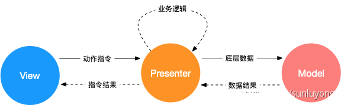
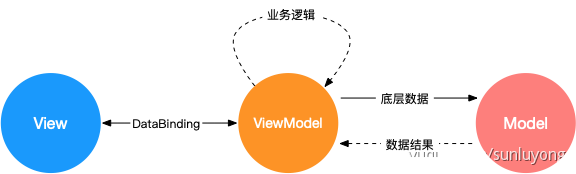

MV\* 是指各种 MVC、MVP、MVVM 等 Web 设计模式，通过分离关注点来改进代码的组织方式

如下的代码，视图渲染和数据处理的逻辑杂糅在一起，随着业务逻辑逐渐复杂，代码将难以维护

```js
<div>
  <span id="container">0</span>
  <button id="btn" onclick="javascript:add()">+</button>
</div>

<script>
  function add (){
    const container = document.getElementById('container');
    const current = parseInt(container.innerText);
    container.innerText = current + 1;
  }
</script>
```

#### MVC

MVC 是 Model View Controller 的缩写

- Model：模型层，数据相关的操作
- View：视图层，用户界面渲染逻辑
- Controller：控制器，数据模型和视图之间通信的桥梁

MVC 模型有很多变种，最传统的 MVC 模型把视图渲染和数据处理做了隔离，通过 Controller 接收 View 操作，传递给 Model，数据 ready 后由 Model 驱动视图渲染


上述例子修改如下

```js
// view
<div>
  <span id="container">0</span>
  <button id="btn">+</button>
</div>;

// model
function add(node) {
  // 业务逻辑处理
  const currentValue = parseInt(node.innerText);
  const newValue = currentValue + 1;
  // 更新视图
  node.innerText = newValue + 1;
}

// controller
const button = document.getElementById('btn');
// 响应视图指令
button.addEventListener(
  'click',
  () => {
    const container = document.getElementById('container');
    // 调用模型
    add(container);
  },
  false
);
```

其中为了让 Model 和 View 尽量地解耦，Controller 获取了节点并传给了 Model，这样就与 View 产生了耦合，由于 Controller 是 View 和 Model 沟通的桥梁，这样的耦合是可以接受的

View 的更新需要由 Model 处理，或者通过观察者模式让 View 监听 Model 的变化更新，无论怎样 View 和 Model 都存在耦合

#### MVP

MVP 是 Model View Presenter 的缩写

- Model：和具体业务无关的数据处理
- View：用户界面渲染逻辑
- Presenter：响应视图指令，同时进行相关业务处理，必要时候获调用 Model 获取底层数据，返回指令结果到视图，驱动视图渲染



相比于 MVC 有以下几个变化

- View 和 Model 完全隔离，Model 不再负责业务逻辑和视图变化，只负责底层数据处理
- Presenter 接管路由和业务逻辑，但要求 View 实现 View Interface，方便和具体 View 解耦，可以不依赖 UI 进行单元测试
- View 层只负责发起指令和根据数据渲染 UI，不再有主动监听数据变化等行为，所以也被称之为被动视图

上述例子修改如下

```js
// view
<div>
	<span id="container">0</span>
  <button id="btn">+</button>
</div>
<script>
  // View Interface
	const globalConfig = {
  	containerId: 'container',
    buttonId: 'btn',
  };
</script>

// model
function add (num) {
  return num + 1;
}

// presenter
const button = document.getElementById(globalConfig.containerId);
const container = document.getElementById(globalConfig.buttonId);
// 响应视图指令
button.addEventListener('click', () => {
  const currentValue = parseInt(container.innerText);
  // 调用模型
	const newValue = add(currentValue);
  // 更新视图
  container.innerText = newValue;
}, false);
```

这样 Model 只需要处理与业务无光的逻辑，而 Presenter 和 View 通过 View interface 桥接，相比于 MVC 耦合度降低了很多

#### MVVM

MVVM 是 Model View - ViewModel 的缩写

- View 和 Model 职责和 MVP 相同
- ViewModel 主要靠 DataBinding 把 View 和 Model 做了自动关联，框架替应用开发者实现数据变化后的视图更新，相当于简化了 Presenter 的部分功能



vue 就是应用了 MVVM 模式，上述例子用 vue 修改如下

```js
// view
<div id="test">
  <!-- 数据和视图绑定 -->
	<span>{{counter}}</span>
  <button v-on:click="counterPlus">+</button>
</div>

// model
function add (num) {
  return num + 1;
}

// viewModel
new Vue({
  el: '#test',
  data: {
    counter: 0
  },
  methods: {
  	counterPlus: function () {
     	// 只需要修改数据，无需手工修改视图
    	this.counter = add(this.counter);
    }
  }
})
```

在 View 中做了数据和视图的绑定，在 ViewModel 中只需要更新数据，视图就会自动变化，DataBinding 由框架实现

#### 总结

- MVC 对视图和数据做了第一步的分离，实现简单，但 View、业务逻辑、底层数据模型 分离的不彻底
- MVP 通过 Presenter 彻底解耦了 View 和 Model，同时剥离了业务逻辑和底层数据逻辑，让 Model 变得稳定，但业务逻辑复杂情况下 Presenter 会相对臃肿
- MVVM 通过 DataBinding 实现了视图和数据的绑定，但依赖框架实现，增加了理解成本，在错误使用的情况下调试复杂
